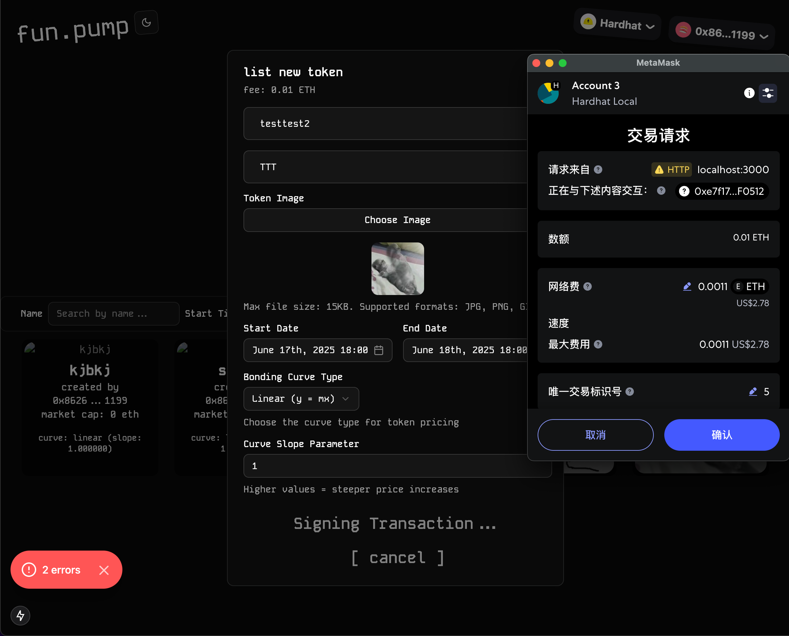
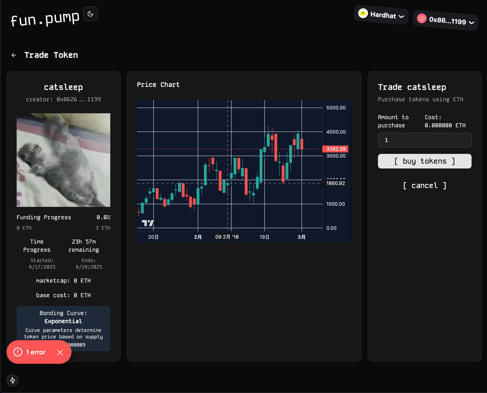

# Fun Pump

A decentralized crowdfunding platform using smart contracts and modern web technologies.

<div style="display: flex; justify-content: space-between;">
  
  
</div>


## Technology Stack & Tools

- **Smart Contracts**: Solidity (Writing Smart Contracts & Tests)
- **Development Framework**: [Hardhat](https://hardhat.org/) with [Hardhat Ignition](https://hardhat.org/ignition/docs/getting-started) (Deployment Management)
- **Runtime & Package Manager**: [Bun](https://bun.sh/) (Fast JavaScript Runtime)
- **Frontend Framework**: [Next.js 15](https://nextjs.org/) (React Framework)
- **Blockchain Integration**: [Wagmi v2](https://wagmi.sh/) (React Hooks for Ethereum) + [RainbowKit](https://www.rainbowkit.com/) (Wallet Connection)
- **State Management**: [Jotai](https://jotai.org/) (Atomic State Management) + [TanStack Query](https://tanstack.com/query/latest) (Data Fetching & Caching)
- **File Storage**: [Pinata](https://www.pinata.cloud/) (IPFS Storage)
- **UI Components**: [Shadcn/ui](https://ui.shadcn.com/) (Modern UI Components)
- **Styling**: [Tailwind CSS v4](https://tailwindcss.com/) (Utility-First CSS)
- **Form Handling**: [React Hook Form](https://react-hook-form.com/) + [Zod](https://zod.dev/) (Schema Validation)
- **Language**: TypeScript (Type Safety)

## Requirements For Initial Setup

- Install [Bun](https://bun.sh/): `curl -fsSL https://bun.sh/install | bash`

## Project Structure

This is a monorepo structure with the following packages:

```
fun-pump/
├── packages/
│   ├── smart-contract/         # Solidity smart contracts package
│   │   ├── contracts/          # Smart contract source files
│   │   │   ├── Factory.sol     # Main factory contract
│   │   │   ├── Token.sol       # Token implementation
│   │   │   ├── interfaces/     # Contract interfaces
│   │   │   └── libraries/      # Reusable libraries
│   │   ├── src/                # TypeScript source (exported)
│   │   │   ├── types/          # TypeScript type definitions
│   │   │   ├── generated.ts    # Wagmi-generated hooks
│   │   │   └── index.ts        # Package entry point
│   │   ├── dist/               # Built TypeScript files
│   │   ├── test/               # Contract tests
│   │   ├── ignition/           # Hardhat Ignition deployment
│   │   └── artifacts/          # Compiled contract artifacts
│   └── web/                    # Next.js frontend application
│       ├── app/                # Next.js app directory
│       ├── components/         # React components
│       ├── hooks/              # Custom React hooks
│       ├── stores/             # Jotai state stores
│       ├── lib/                # Utility functions
│       └── providers/          # React context providers
├── scripts/                    # Development scripts
└── README.md                   # This file
```

## Setting Up

### 1. Clone/Download the Repository
```bash
git clone <repository-url>
cd fun-pump
```

### 2. Install Dependencies
```bash
# Install all dependencies for the monorepo
bun install
```

### 3. Build Smart Contract Package
```bash
# Compile contracts and build TypeScript package
bun compile
```

### 4. Start Local Blockchain Node
```bash
# Start Hardhat local node
bun node
```

### 5. Deploy Contracts
In a separate terminal, run:
```bash
# For local development
bun deploy:local

# For deployment with reset (clean slate)
bun deploy:local:reset
```

### 6. Generate Contract Bindings
After deployment, generate the TypeScript bindings:
```bash
# Generate Wagmi hooks and TypeScript types
bun --cwd packages/smart-contract build:wagmi
```

### 7. Start Frontend Development Server
```bash
# Start Next.js development server
bun dev
```

### 8. Full Development Environment
To start all services with file watching:
```bash
# Start blockchain node + contract watcher + frontend
bun dev:full
```

## Environment Variables

Create a `.env.local` file in the `packages/web` directory with the following variables:

```bash
# Pinata IPFS
PINATA_API_KEY=your_pinata_api_key
NEXT_PUBLIC_GATEWAY_URL=your_pinata_gateway_url

# Add other environment variables as needed
```

Note: Never commit your `.env.local` file to version control.

## Available Scripts

### Root-level Scripts

```bash
# Start the Next.js development server
bun dev

# Build the frontend for production
bun build

# Start the production server
bun start

# Run contract tests
bun test

# Compile smart contracts
bun compile

# Deploy contracts (requires configured network)
bun deploy

# Deploy contracts to local network
bun deploy:local

# Start local Hardhat node
bun node

# Run type checking
bun typecheck

# Watch contracts and rebuild on changes
bun dev:contracts

# Start complete development environment
bun dev:full

# Clean the project
bun clean

# Format code
bun format
```

### Smart Contract Scripts

```bash
# Compile Solidity contracts
bun --cwd packages/smart-contract compile

# Run contract tests
bun --cwd packages/smart-contract test

# Deploy contracts using Hardhat Ignition
bun --cwd packages/smart-contract deploy

# Generate TypeScript bindings using Wagmi
bun --cwd packages/smart-contract build:wagmi

# Build the entire package (compile + generate + copy)
bun --cwd packages/smart-contract build
```

### Web App Scripts

```bash
# Start development server
bun --cwd packages/web dev

# Build for production
bun --cwd packages/web build

# Start production server
bun --cwd packages/web start
```